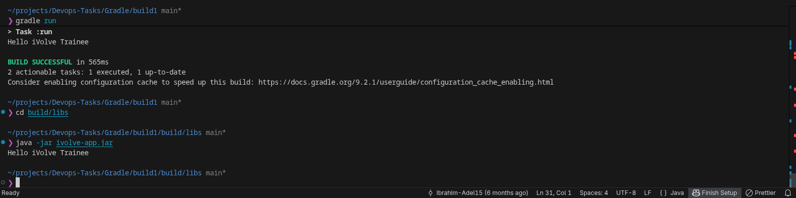

# Lab 1: Building and Packaging Java Applications with Gradle

## Objective
Install Gradle, clone source code, run unit tests, build and run a Java application.

## Prerequisites
- Linux/WSL environment
- Java 17 installed
- Fish shell (optional, for these instructions)

## Lab Steps

### Step 1: Install Gradle
```fish
sudo apt update
sudo apt install gradle
```
### Step 2: Clone Source Code
git clone https://github.com/Ibrahim-Adel15/build1.git
cd build1


### Step 3: Run Unit Tests
```fish
gradle test
```


### Step 4: Build Application
```fish
gradle build
```
*This generates artifact: `build/libs/ivolve-app.jar`*

### Step 5: Run Application
```fish
java -jar build/libs/ivolve-app.jar
```

## Expected Output




## Author
**Nour Eldeen Mohamed** 