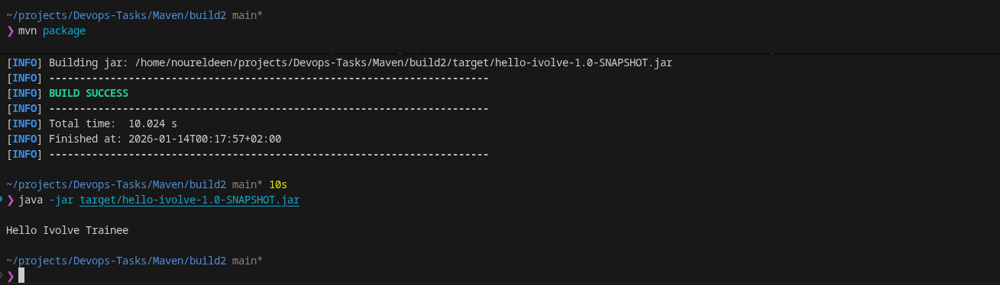

# Lab 2: Building and Packaging Java Applications with Maven

## Objective
Install Maven, clone source code, run unit tests, build and run a Java application.

## Prerequisites
- Linux/WSL environment
- Java 17 installed

## Lab Steps

### Step 1: Install Maven
```fish
sudo apt update
sudo apt install maven
```

### Step 2: Clone Source Code
```fish
git clone https://github.com/Ibrahim-Adel15/build2.git
cd build2
```

### Step 3: Run Unit Tests
```fish
mvn test
```

### Step 4: Build Application
```fish
mvn package
```
*This generates artifact: `target/hello-ivolve-1.0-SNAPSHOT.jar`*

### Step 5: Run Application
```fish
java -jar target/hello-ivolve-1.0-SNAPSHOT.jar
```

### Step 6: Verify Application
Check that the application starts successfully and produces expected output.

## Expected Output
# My Project Screenshots




## Author
**Nour Eldeen Mohamed** 